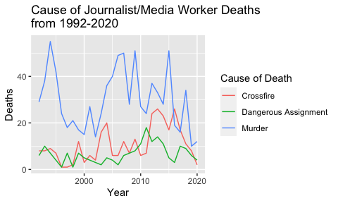
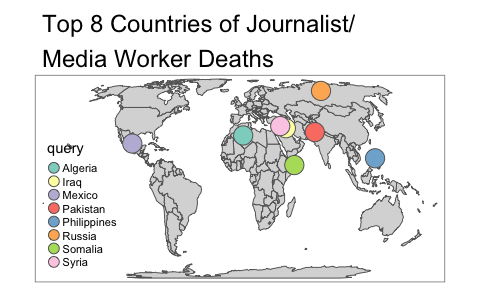

<!-- README.md is generated from README.Rmd. Please edit that file -->

# ReporterDeaths

<!-- badges: start -->

<!-- badges: end -->

The goal of ReporterDeaths is to …

## Installation

You can install the development version from
[GitHub](https://github.com/) with:

``` r
# install.packages("devtools")
devtools::install_github("swei1999/ReporterDeaths")
```

## Analysis Examples

``` r
library(ReporterDeaths)
data("ReporterDeaths")
```

### a. Provide a nice table to illustate the different causes of death of journalists/media workers covered in this dataset. What different causes of death are there and which cause results in the most death?

SOLUTION:

``` r
# Data for solution
total_deaths <- ReporterDeaths %>% 
  group_by(cause_of_death) %>% 
  summarize(Deaths = n()) %>% 
  rename(`Cause of Death` = cause_of_death)

# Generate nice table
kable(total_deaths) %>% 
  kable_styling(latex_options = c("striped", "HOLD_position")) %>% 
  row_spec(0, bold = TRUE)
```

<table class="table" style="margin-left: auto; margin-right: auto;">

<thead>

<tr>

<th style="text-align:left;font-weight: bold;">

Cause of Death

</th>

<th style="text-align:right;font-weight: bold;">

Deaths

</th>

</tr>

</thead>

<tbody>

<tr>

<td style="text-align:left;">

Crossfire

</td>

<td style="text-align:right;">

308

</td>

</tr>

<tr>

<td style="text-align:left;">

Dangerous Assignment

</td>

<td style="text-align:right;">

181

</td>

</tr>

<tr>

<td style="text-align:left;">

Murder

</td>

<td style="text-align:right;">

869

</td>

</tr>

</tbody>

</table>

The dataset provides information about journalists/media workers that
are killed by crossfire, dangerous assignments, or murdered.

The large majority of journalists/media workers are murdered (869
deaths).

### b) Generate a timeplot of journalist/media worker deaths. Use different colors to distinguish between the different causes of death.

SOLUTION:

``` r
# Generate the time plot
ReporterDeaths %>% 
  group_by(year, cause_of_death) %>% 
  summarise(Deaths = n()) %>% 
  ggplot(aes(x = year, y = Deaths)) +
  geom_line(aes(color = cause_of_death)) + 
  ggtitle("Cause of Journalist/Media Worker Deaths \nfrom 1992-2020") +
  labs(x = "Year", color = "Cause of Death")
#> `summarise()` regrouping output by 'year' (override with `.groups` argument)
```



From the time plot, we can see that death by murder fluctuates pretty
heavily. This could potentially mean that the high peaks were times of
turmoil that required more journalists/media workers to go out in the
field.

### c) According to the data provided, what job resulted in the most journalist/media worker deaths? If there are multiple jobs associated with a given name, let each job contribute to the overall death count of that job.

SOLUTION:

``` r
# Standardize values by turning them all to upper case
job_deaths <- mutate(ReporterDeaths, jobs = toupper(jobs))

# Put each observation in the jobs column into one big string separated by commas - 
# this accounts for when someone had multiple jobs
job_deaths <- paste(job_deaths$jobs, collapse = ",")

# Turn large string into a character array
job_deaths <- strsplit(job_deaths, ",")

# Create frequency table from the character array
table(job_deaths)
#> job_deaths
#>    BROADCAST REPORTER       CAMERA OPERATOR COLUMNIST/COMMENTATOR 
#>                   358                   233                   112 
#> DOCUMENTARY FILMMAKER                EDITOR     INTERNET REPORTER 
#>                     1                   197                   102 
#>          PHOTOGRAPHER        PRINT REPORTER              PRODUCER 
#>                   165                   357                    74 
#>       PUBLISHER/OWNER              REPORTER            TECHNICIAN 
#>                    62                     1                    22
```

The job that is most associated with journalist/media worker deaths in
this dataset is a broadcast reporter (358 deaths).

Print reporters come in a close second with 357 deaths.

### d) Generate a map with appropriate labels to show the top 8 countries where journalists/media workers are killed. (Hint: Use data(“World”) from the tmap package for the base map, geocode\_OSM() from the tmaptools package to get the latitude and longitude values, and the tmap package to print the map.)

SOLUTION:

``` r
data("World")

# Get top 8 countries where journalists/media workers are killed
location_deaths <- ReporterDeaths %>% 
  group_by(country) %>% 
  summarise(Deaths = n()) %>%
  arrange(desc(Deaths)) %>% 
  head(8) %>% 
  rename(query = country)
#> `summarise()` ungrouping output (override with `.groups` argument)

# Get latitude/longitude values for the countries
countries <- tmaptools::geocode_OSM(c(as.vector(t(location_deaths["query"][, ]))),
                                 as.sf = TRUE)

# Print the map with circles denoting the countries of interest
tm_shape(World) + tm_polygons() +
  tm_shape(countries) + tm_bubbles(col = "query") + 
  tm_layout(main.title= "Top 8 Countries of Journalist/\nMedia Worker Deaths")
```



The top 8 countries where journalists/media workers are killed are Iraq,
Syria, the Philippines, Somalia, Algeria, Pakistan, Russia, and Mexico.

### Final Insights

This dataset from the CPJ (Committee to Protect Journalists) provides
data on journalist/media worker deaths around the world, such as cause
of death, country of death, and specific job. In particular, it provides
information about worker deaths from crossfire, dangerous assignments,
and murder. From the table and timeplot from parts a and b, we see that
the majority of journalists/media workers are murdered. From part c, we
gain that the most dangerous jobs are broadcast reporters, print
reporters, camera operators, and editors. Lastly, from part d, we see
that the most deaths occur in Iraq, Syria, the Philippines, Somalia,
Algeria, Pakistan, Russia, and Mexico.
